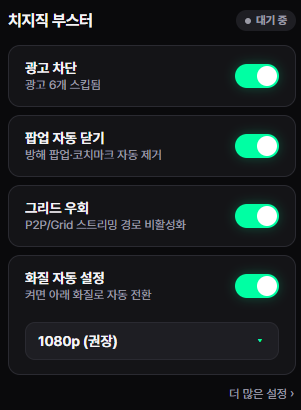
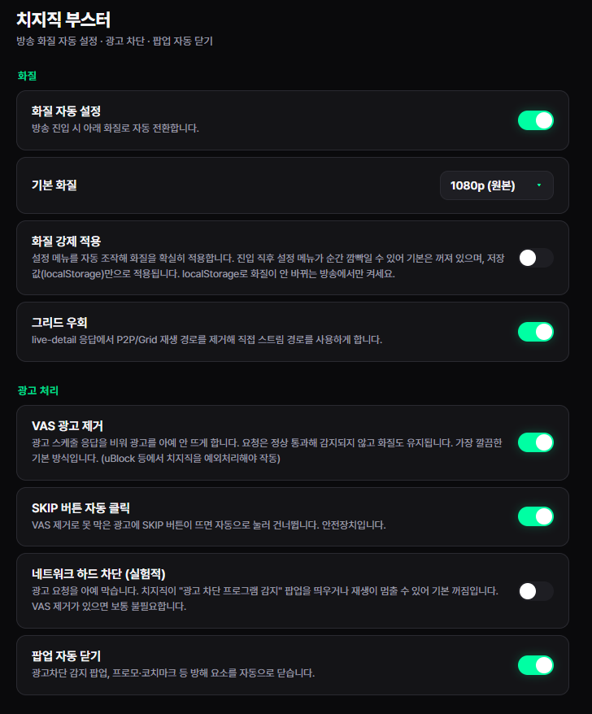

# 치지직 부스터

**치지직 라이브 시청 환경을 정리하는 Chrome MV3 확장 프로그램**

치지직 방송 페이지에서 기본 화질 자동 설정, 그리드 우회, 광고 처리, 방해 팝업 자동 닫기를 제공하는 브라우저 확장 프로그램입니다.

Chrome 확장 MV3 · JavaScript · HTML · CSS · chrome.storage · declarativeNetRequest · fetch/XHR 응답 후킹

- 서비스명: 치지직 부스터
- 개발 형태: 개인 프로젝트
- 프로젝트 기간: 2026.07
- 주요 대상: 치지직 라이브 시청자

---

## 목차

1. [프로젝트 소개](#1-프로젝트-소개)
2. [주요 화면](#2-주요-화면)
3. [주요 기능](#3-주요-기능)
4. [시스템 아키텍처](#4-시스템-아키텍처)
5. [기술 스택과 선택 이유](#5-기술-스택과-선택-이유)
6. [핵심 구현 상세](#6-핵심-구현-상세)
7. [트러블슈팅](#7-트러블슈팅)
8. [프로젝트 구조](#8-프로젝트-구조)
9. [실행 방법](#9-실행-방법)
10. [권한과 저장소](#10-권한과-저장소)
11. [알려진 한계](#11-알려진-한계)

---

## 1. 프로젝트 소개

치지직 부스터는 치지직 라이브 페이지에서 반복적으로 발생하는 시청 불편 요소를 줄이기 위해 만든 확장 프로그램입니다.

라이브 방송 진입 시 화질이 낮게 시작되는 문제를 `localStorage` 기반 설정으로 보정하고, 필요할 때는 플레이어 설정 메뉴를 직접 조작해 목표 화질을 다시 적용합니다. 그리드 우회는 라이브 상세 응답에서 P2P/Grid 재생 경로를 제거하는 방식으로 처리합니다.

광고 처리 기능은 요청 자체를 무리하게 막는 방식보다 안전한 응답 보정과 자동 클릭을 우선합니다. 네트워크 하드 차단은 치지직의 광고 차단 감지 팝업을 유발할 수 있어 실험 기능으로 분리했습니다.

이 프로젝트는 다음 문제를 해결하는 데 초점을 맞췄습니다.

- 방송 진입 시 지정한 기본 화질로 자동 전환
- 플레이어 재초기화, 방송 이동, 광고 이후에도 화질 설정 재적용
- live-detail 응답의 P2P/Grid 관련 필드 제거
- 광고 스케줄 응답 보정과 SKIP 버튼 자동 클릭
- 광고 차단 감지 팝업, 프로모션, 코치마크 자동 닫기
- 팝업 메뉴에서 자주 쓰는 기능을 빠르게 켜고 끄는 흐름 제공

---

## 2. 주요 화면

| 기본 팝업 | 상세 설정 |
| --- | --- |
|  |  |

기본 팝업은 자주 사용하는 광고 차단, 팝업 자동 닫기, 그리드 우회, 화질 자동 설정을 한 화면에서 제어하도록 구성했습니다. 상세 설정 페이지는 화질 강제 적용과 네트워크 하드 차단처럼 사용 조건을 이해하고 켜야 하는 기능을 분리해 배치했습니다.

---

## 3. 주요 기능

| 기능 | 설명 |
| --- | --- |
| **화질 자동 설정** | 방송 진입 시 `live-player-video-track` 값을 지정한 화질로 세팅합니다. 기본값은 1080p입니다. |
| **기본 화질 선택** | 1080p, 720p, 480p, 360p 중 목표 화질을 선택할 수 있습니다. |
| **화질 강제 적용** | 저장값만으로 화질이 바뀌지 않는 경우 플레이어 설정 메뉴를 자동 조작해 화질을 적용합니다. |
| **그리드 우회** | live-detail 응답에서 P2P/Grid 경로를 제거해 직접 스트림 경로를 사용하게 합니다. |
| **VAS 광고 제거** | 광고 스케줄(`vas`) 응답의 광고 구간을 비우고, 치지직 API 응답의 `skipPreRollAd`를 켜 프리롤 광고 호출을 줄입니다. |
| **SKIP 버튼 자동 클릭** | 광고 제거로 막지 못한 광고(VAS 프리롤, GFP `fxview` 오버레이 등)에 SKIP 버튼이 나타나면 자동으로 클릭합니다. |
| **팝업 자동 닫기** | 광고 차단 감지 팝업, 프로모션, 코치마크를 감지해 닫습니다. |
| **네트워크 하드 차단** | 광고 요청을 DNR 룰셋으로 차단하는 실험 기능입니다. 기본값은 꺼짐입니다. |

---

## 4. 시스템 아키텍처

```text
사용자
  |
  | 팝업 메뉴 / 옵션 페이지 설정 변경
  v
chrome.storage.sync
  |
  | 설정 변경 이벤트
  v
콘텐츠 스크립트
  - 화질 localStorage 선주입
  - 팝업과 코치마크 닫기
  - SKIP 버튼 자동 클릭
  - 페이지 전역 옵션 플래그 전달
  |
  | localStorage 플래그
  v
페이지 전역 스크립트
  - fetch 응답 보정
  - XHR 응답 보정
  - VAS 광고 스케줄 제거
  - live-detail P2P/Grid 필드 제거
  |
  v
치지직 플레이어

백그라운드 서비스 워커
  - DNR 룰셋 on/off
  - 광고 스킵 횟수 저장
```

확장 UI는 `chrome.storage.sync`를 기준으로 설정을 저장합니다. 실제 페이지 동작은 content script가 담당하고, 페이지 전역의 fetch/XHR 응답을 건드려야 하는 작업은 페이지 전역 스크립트로 분리했습니다.

---

## 5. 기술 스택과 선택 이유

| 기술 | 선택 이유 |
| --- | --- |
| **Chrome 확장 MV3** | Chrome과 Edge에서 바로 사용할 수 있는 확장 구조입니다. |
| **JavaScript** | 별도 빌드 없이 압축해제 확장으로 바로 로드할 수 있어 테스트와 수정이 빠릅니다. |
| **HTML/CSS** | 팝업과 옵션 페이지를 가볍게 구성하기에 충분합니다. |
| **chrome.storage.sync** | 팝업, 옵션 페이지, content script가 같은 설정값을 공유할 수 있습니다. |
| **chrome.storage.local** | 광고 스킵 횟수처럼 동기화가 필요 없는 상태를 저장합니다. |
| **declarativeNetRequest** | 사용자가 명시적으로 켠 경우 광고 요청을 브라우저 레벨에서 차단합니다. |
| **페이지 전역 content script** | 페이지의 fetch/XHR을 직접 감싸 live-detail과 VAS 응답을 보정합니다. |
| **localStorage** | 치지직 플레이어가 읽는 화질 설정값과 페이지 전역 옵션 플래그 전달에 사용합니다. |

---

## 6. 핵심 구현 상세

### 6-1. 화질 자동 설정

치지직 플레이어는 `live-player-video-track` 값을 읽어 초기 화질을 결정합니다. 확장은 문서 로드 초기에 이 값을 사용자가 선택한 화질 프리셋으로 세팅합니다.

화질 프리셋은 다음 기준으로 관리합니다.

| 옵션 | 해상도 |
| --- | --- |
| 1080p | 1920 x 1080 |
| 720p | 1280 x 720 |
| 480p | 854 x 480 |
| 360p | 640 x 360 |

단순히 한 번만 쓰지 않고 1초 간격으로 값을 확인해 버퍼링, 광고, 방송 이동 이후에도 화질 설정이 유지되도록 했습니다. 치지직은 SPA 방식으로 방송 페이지가 이동하므로 `location.href` 변화도 함께 감지합니다.

### 6-2. 화질 강제 적용

일부 상황에서는 저장값이 있어도 플레이어가 즉시 반영하지 않을 수 있습니다. 이때는 옵션의 화질 강제 적용을 켜면 설정 메뉴를 자동으로 열고 목표 화질 항목을 클릭합니다.

사용한 기준 셀렉터는 실측 결과를 바탕으로 정리했습니다.

| 대상 | 셀렉터 |
| --- | --- |
| 설정 버튼 | `.pzp-pc-setting-button`, `.pzp-setting-button` |
| 화질 메뉴 | `.pzp-setting-intro-quality` |
| 화질 목록 | `.pzp-setting-quality-pane__list-container` |
| 화질 항목 | `.pzp-ui-setting-quality-item` |
| 선택 상태 | `.pzp-ui-setting-pane-item--checked` |

자동 조작 중 설정 패널이 보이면 시청 흐름을 방해할 수 있어, 조작하는 동안 관련 UI를 잠시 투명 처리한 뒤 닫습니다.

### 6-3. 그리드 우회

그리드 우회는 live-detail 응답을 보정하는 방식으로 구현했습니다. 응답 안의 `content.p2pQuality`를 비우고, `livePlaybackJson` 내부의 P2P 관련 필드를 제거합니다.

처리 대상은 다음과 같습니다.

| 필드 | 처리 |
| --- | --- |
| `content.p2pQuality` | 빈 배열로 변경 |
| `playback.meta.p2p` | false로 변경 |
| `track.p2pPath` | 삭제 |
| `track.p2pPathUrlEncoding` | 삭제 |

fetch와 XHR 양쪽을 모두 감싸 같은 응답 보정이 적용되도록 했습니다. 토글을 끄면 원본 응답을 그대로 통과시킵니다.

### 6-4. 광고 처리

치지직은 한 가지 광고만 쓰지 않습니다. 실측 결과 최소 두 가지 경로가 확인됐습니다.

| 광고 종류 | 요청 경로 | 재생 방식 | 스킵 버튼 |
| --- | --- | --- | --- |
| VAS 프리롤 | `nam.veta.naver.com/vas` | pzp 플레이어 프리롤 | `btn_skip` |
| GFP 오버레이 | `siape.veta.naver.com/fxview` | 오버레이 재생 + 본방송 PIP 축소 | `skip_area`, `txt_skip` |

그래서 광고 처리를 다음 단계로 나눴습니다.

```text
VAS 응답 보정 (adBreaks 비우기 + skipPreRollAd 강제)
  |
  | 막지 못한 광고(VAS 프리롤 / GFP fxview 오버레이)가 있는 경우
  v
SKIP 버튼 자동 클릭 (카운트다운이 끝나 'SKIP'만 남은 순간)
  |
  | 광고 차단 감지 팝업이 뜬 경우
  v
팝업 닫기와 dimmed 정리
```

VAS 응답 보정은 `adBreaks`를 비우는 것에 더해 치지직 API 응답의 `skipPreRollAd` 값을 `true`로 바꿔 플레이어가 프리롤을 건너뛰도록 유도합니다. GFP `fxview` 오버레이 광고는 응답 보정으로 막기 어려워, 스킵 버튼(`skip_area`, `txt_skip`)이 활성화되는 즉시 자동으로 클릭합니다. 이때 "광고 페이지 보기"(`link_more`)는 절대 클릭하지 않습니다.

초기 구현에서 네트워크 요청을 직접 차단하면 치지직의 광고 차단 감지 팝업이 뜨고 화질이 낮아지는 문제가 있었습니다. 그래서 기본 광고 처리는 요청 차단보다 응답 보정과 버튼 클릭을 우선하도록 정리했습니다.

### 6-5. 팝업 자동 닫기

광고 차단 감지 팝업은 문구 기반으로 찾습니다. 확인 버튼이 있으면 실제 사용자 클릭에 가까운 pointer, mouse, click 이벤트 순서로 닫고, 남아 있는 dimmed 요소와 overflow 잠금도 함께 정리합니다.

프로모션과 코치마크는 치지직 localStorage 키 패턴을 기준으로 이미 확인한 상태처럼 처리합니다.

---

## 7. 트러블슈팅

### 광고 차단 감지 팝업과 화질 360p 고정

초기에는 광고 도메인을 DNR로 바로 차단했습니다. 이 방식은 치지직의 광고 차단 감지를 유발했고, 감지 상태에서는 팝업이 뜨면서 화질이 360p로 내려가는 문제가 있었습니다.

해결 방식은 다음과 같습니다.

- 네트워크 하드 차단을 기본 꺼짐으로 변경
- VAS 응답 보정과 SKIP 버튼 자동 클릭을 기본 광고 처리로 사용
- 하드 차단은 상세 설정의 실험 기능으로 분리

### 설정 메뉴가 바로 닫히는 문제

광고 SKIP 버튼을 찾는 셀렉터가 너무 넓어 플레이어의 실시간 이동 버튼까지 클릭하는 문제가 있었습니다. 이 클릭이 설정 메뉴 밖 클릭으로 처리되어 메뉴가 바로 닫혔습니다.

해결 방식은 다음과 같습니다.

- 광고 문맥이 있는 버튼만 SKIP 대상으로 제한
- 광고, skip, 스킵, 건너뛰기, ad-skip 기준으로 탐지
- 화면에 보이는 버튼만 클릭하도록 조건 추가

### 팝업을 닫아도 화면이 잠기는 문제

모달을 닫은 뒤 dimmed 레이어나 `overflow: hidden`이 남으면 화면 조작이 막힐 수 있습니다.

해결 방식은 다음과 같습니다.

- 팝업 카드만 숨기고 앱 루트는 숨기지 않도록 범위 제한
- `.pzp-ui-dimmed`, `.pzp-midroll-dimmed`, `.pzp-pc__midroll-dim` 정리
- body와 documentElement의 overflow 원복

---

## 8. 프로젝트 구조

```text
chzzk/
├─ assets/
│  ├─ icon16.png
│  ├─ icon32.png
│  ├─ icon48.png
│  ├─ icon128.png
│  ├─ icon1024.png
│  └─ readme/
│     ├─ popup.png
│     └─ options.png
├─ manifest.json
├─ rules/
│  └─ adblock.json
├─ src/
│  ├─ background/
│  │  └─ sw.js
│  ├─ content/
│  │  ├─ content.js
│  │  └─ main-world.js
│  ├─ options/
│  │  ├─ options.html
│  │  └─ options.js
│  └─ popup/
│     ├─ popup.html
│     └─ popup.js
├─ _locales/
│  └─ ko/
│     └─ messages.json
└─ README.md
```

---

## 9. 실행 방법

이 프로젝트는 별도 빌드 과정 없이 압축해제 확장으로 바로 로드합니다.

1. Chrome 주소창에서 `chrome://extensions`로 이동합니다.
2. 개발자 모드를 켭니다.
3. 압축해제된 확장 프로그램 로드를 누릅니다.
4. `C:\Users\admin\Desktop\chzzk` 폴더를 선택합니다.
5. 치지직 방송 탭을 새로고침합니다.

Edge에서도 같은 방식으로 사용할 수 있습니다.

1. Edge 주소창에서 `edge://extensions`로 이동합니다.
2. 개발자 모드를 켭니다.
3. 압축을 푼 확장 로드를 누릅니다.
4. 프로젝트 폴더를 선택합니다.

코드를 수정한 뒤에는 확장 프로그램 관리 화면에서 새로고침 버튼을 누르고, 열려 있는 치지직 탭도 다시 새로고침해야 합니다.

---

## 10. 권한과 저장소

| 항목 | 용도 |
| --- | --- |
| `storage` | 사용자 설정과 광고 스킵 횟수 저장 |
| `declarativeNetRequest` | 네트워크 하드 차단 기능을 켠 경우 룰셋 적용 |
| `host_permissions` | 치지직 페이지에 content script 주입 |
| `chrome.storage.sync` | 화질, 광고 처리, 팝업 닫기, 그리드 우회 설정 저장 |
| `chrome.storage.local` | 광고 스킵 카운트 저장 |
| 페이지 `localStorage` | 플레이어 화질 설정과 페이지 전역 플래그 전달 |

---

## 11. 알려진 한계

- 치지직 플레이어의 DOM 클래스나 응답 구조가 바뀌면 셀렉터와 응답 보정 로직을 다시 확인해야 합니다.
- 광고 SKIP 버튼은 실제 광고 노출 상황에 따라 추가 보정이 필요할 수 있습니다. 특히 GFP `fxview` 오버레이 광고는 응답 보정으로 완전히 막기 어려워 스킵 버튼 자동 클릭에 의존합니다.
- 네트워크 하드 차단은 광고 차단 감지 팝업을 유발할 수 있어 기본값을 꺼짐으로 유지합니다.
- 화질 강제 적용은 플레이어 설정 메뉴를 자동 조작하므로 방송 진입 직후 잠깐의 UI 변화가 있을 수 있습니다.
- 그리드 우회는 현재 live-detail 응답 구조를 기준으로 동작합니다.
